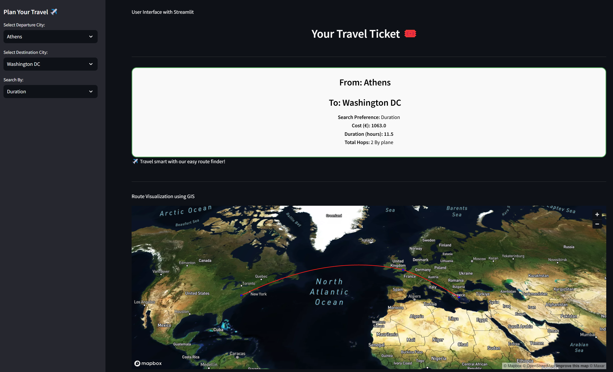

# Interactive AI-Based Travel Planner
| An Interactive Traveling Ticket Planner Using Streamlit, Djikstra's Algorithm and a Satellite Map Box to visualize travel routes 

## Description
> A web-based tool that finds optimal travel routes using Dijkstra's algorithm. Users select departure/destination cities and prioritize either cost or duration. Simplifies trip planning with instant route recommendations.



## Features:
- <span style="font-size: 16px; font-weight: bold;">Interactive User Interface:</span> An interactive user interface experience simplifying the interaction between the user and the backend.
- <span style="font-size: 16px; font-weight: bold;">Best Route: </span> Calculate the best route using Djikstra's Algorithm on two types of weights: Duration/Cost
- <span style="font-size: 16px; font-weight: bold;">Interactive Maps:</span> A visualization of the traveling route with a 3D effect on satellite maps.
- <span style="font-size: 16px; font-weight: bold;">Dynamic UI:</span> A super simple UI that includes drop-downs


## Requirements
- Python
- Miniconda/Anaconda (Virtual Environment)
- pip OR python -m pip

## How to Run
```
conda create -n interactive-travel-planner python==3.8
conda activate interactive-travel-planner
pip install -r requirements.txt
streamlit run main.py
```

